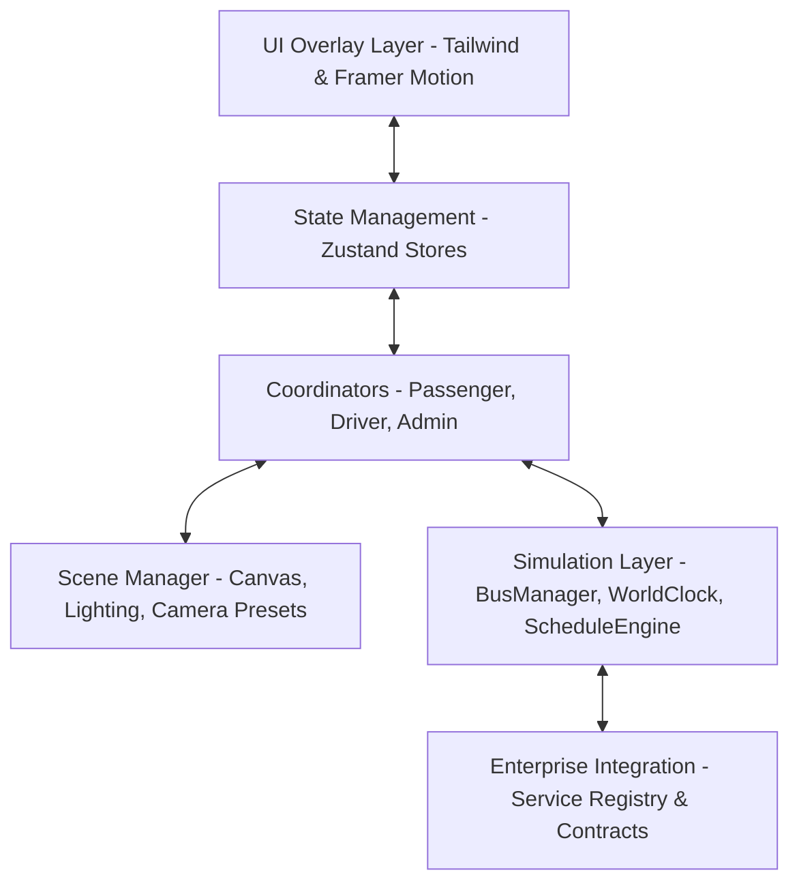

# Navigo High-Level Architecture

This document describes the architectural layout of the Navigo 3D Public Transportation Platform.

---

## 🏗️ Core Layers Layout

---

## 1. 3D Engine & Canvas Layer (`src/three/`)
The interactive 3D map is governed by **React Three Fiber (R3F)** and **Three.js**.
- **`ThreeCanvas.tsx`**: Main entry canvas wrapper. Employs Drei `<Bvh>` raycasting optimization and `<AdaptiveDpr>` pixel resolution scaling.
- **`SceneManager`**: Orchestrates global canvas contexts, camera modes, day/night cycles, lighting rigs, and rendering passes.
- **`NavigationEngine`**: Calculates spline interpolations and manages camera transition fly-overs.
- **`WorldBuilder.ts`**: Procedurally generates the city grid, terrain heightmaps, roads splines, and skyscraper geometries.

---

## 2. Event Bus Mapping (`src/three/SceneEvents.ts`)
A decoupled, singleton event hub facilitating reactive communications across components without direct dependencies.
- **Key Events:**
  - `BUS_SELECTED` / `STOP_SELECTED` / `ROUTE_SELECTED`: Telemetry target switches.
  - `JOURNEY_SELECTED` / `JOURNEY_CLEARED`: Path spline previews.
  - `TRANSIT_ALERT`: Delay alerts.
  - `THEME_CHANGED`: Skybox time changes.

---

## 3. Operations Coordinator Patterns
Coordinators orchestrate state changes, prevent direct component-to-component messaging, and route camera commands to `SceneManager`.
- **`PassengerCoordinator.ts`**: Directs stop selects, bus orbits, and journey splines.
- **`DriverCoordinator.ts`**: Controls Cockpit and Follow cameras by binding coordinate targets to the active bus vectors.
- **`AdminCoordinator.ts`**: Coordinates weather switches, day/night overlays, and simulation speed ticks.

---

## 4. State Management Layer (`src/store/` & Features)
- **`uiStore.ts`**: Active view modes (`landing`, `passenger`, `driver`, `admin`).
- **`sceneStore.ts`**: Day/night triggers, weather types, fog densities.
- **`cameraStore.ts`**: Camera positions, target focus vectors, orbits.
- **`JourneyState.ts`**: Active search results, routes comparisons.
- **`TransitStore.ts`**: Real-time tracked bus logs, notification alerts list.
- **`DriverState.ts` & `AdminState.ts`**: Telemetry and dispatch parameters.
